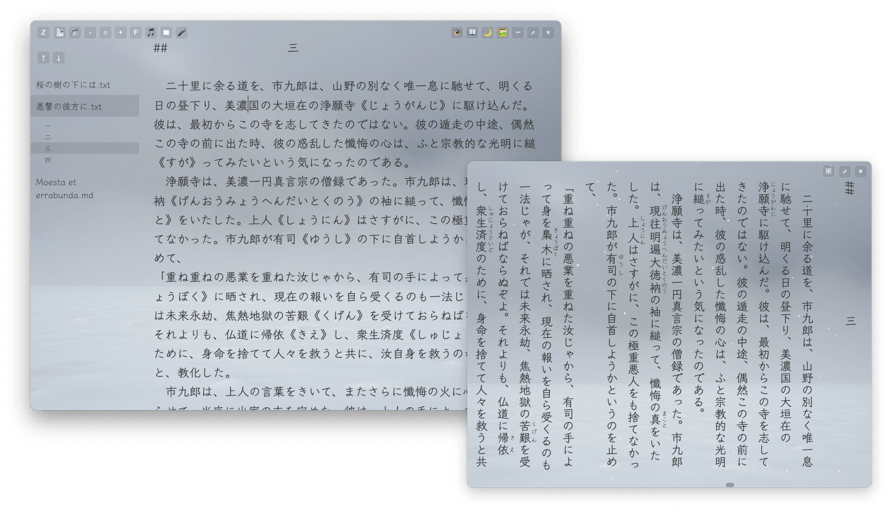
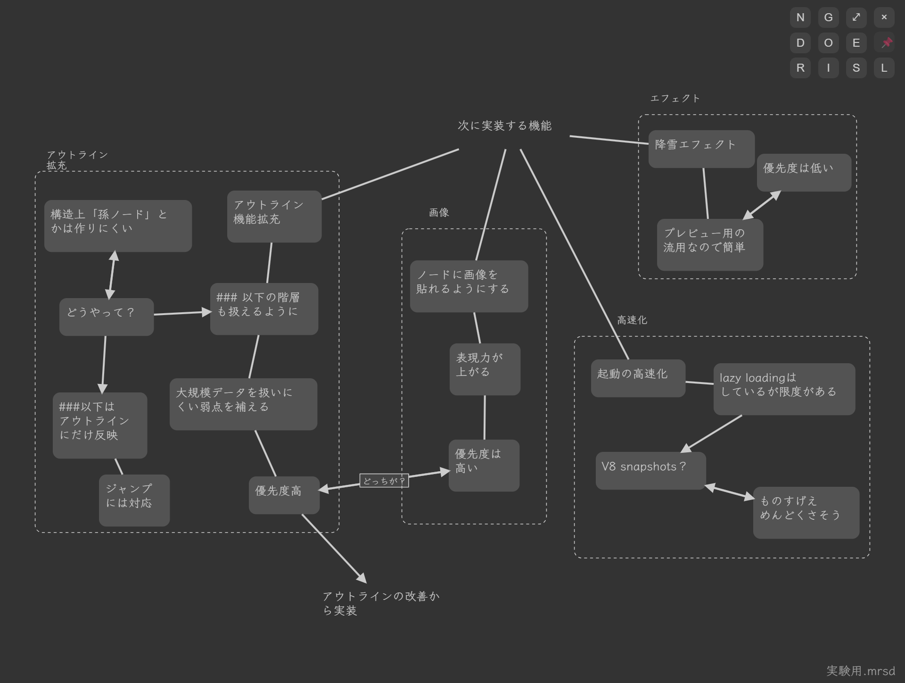
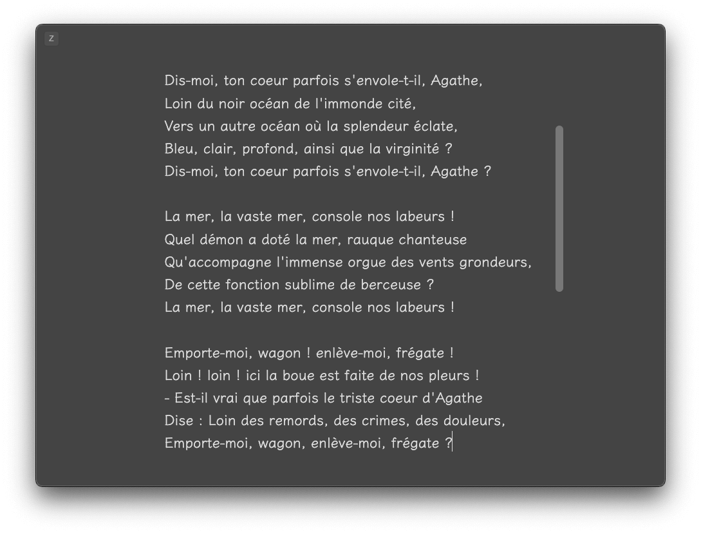
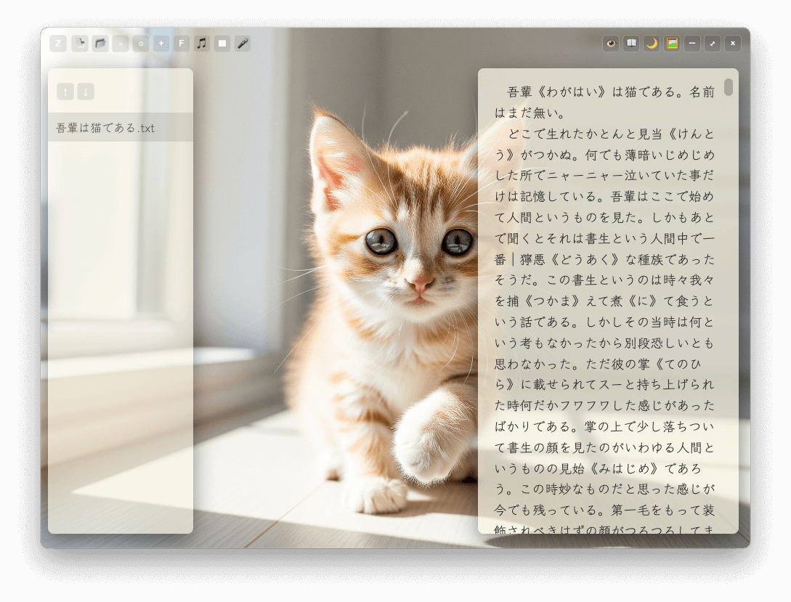
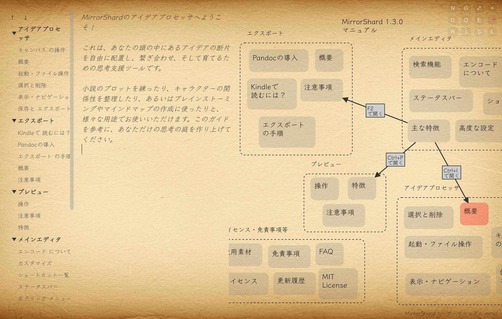

MirrorShard ver. 1.5.0  

AIチャット機能とアイデアプロセッサを搭載した、創作支援用テキストエディタです。  
没入感を重視したミニマルなデザインに仕上げました。  

■ ダウンロード  

[]  
(https://github.com/DroicheadNua/MirrorShard/releases/download/v1.5.0/MirrorShard.Setup.1.5.0.exe)  
[-green)]  
(https://github.com/DroicheadNua/MirrorShard/releases/download/v1.5.0/MirrorShard-1.5.0-arm64.dmg)  
[]  
(https://github.com/DroicheadNua/MirrorShard/releases/download/v1.5.0/MirrorShard-1.5.0-x86_64.AppImage)  

または、[最新のリリース一覧ページ](https://github.com/DroicheadNua/MirrorShard/releases/latest)からダウンロードできます。  

■注意事項  
　インストールやご使用などにつきまして、何か疑問の点等ございましたら「FAQ.md」を御覧ください。  
　それでも解決しない問題がございましたら、MirrorShard開発アカウント
mirrorshard.dev@gmail.com
までご一報いただければ幸いです。  

■主な特徴  
・縦書きと青空文庫形式のルビに対応し、リアルタイムで更新されるプレビューウィンドウ  
・AIチャットウィンドウを搭載。アイコンも表示可能  

・アイデアプロセッサを搭載。発想支援、マインドマップ作成、情報整理など多彩な使い方が可能。AI連携による発想支援機能も搭載  

・数十万行に及ぶ巨大サイズのテキストにも対応  
・マークダウン記法によるアウトライン機能を搭載。またタブとアウトラインパネルが一体化した構造により、複数のテキストファイルをシームレスに運用可能  
・フレームレスウィンドウを採用したミニマルなデザインに加え、UIを非表示にできるZENモードを搭載  

・BGMと背景画像の読み込みに対応  
・半透明ウィンドウを採用し、背景画像を広く表示するモードを搭載。背景画像を活かしたい方、痛エディタを作りたい方などにも好適  
・安全なファイル保存機能（アトミックセーブ）を採用。停電やPCクラッシュなど、不測の事態にも強い設計  
　※ただし仕様上、「ファイル作成日＝ファイル更新日」になります。詳しくはFAQを御覧ください。  

■ショートカット一覧  
本ソフトウェアは、操作のほぼすべてをキーボードショートカットで行うことができます。  
ZENモード（UI非表示）状態でもショートカットは有効ですので、没入感を求める方はZENモードの使用がおすすめです。  

◯ファイル操作  
新規ファイル	Ctrl + N（Cmd + N）　新しいタブを作成します。  
ファイルを開く	Ctrl + O（Cmd + O）　ファイル選択ダイアログを開きます。  
ファイルを保存	Ctrl + S（Cmd + S）　上書き保存します。  
アプリを終了	Ctrl + Q（Cmd + Q）　アプリを終了します。  
素材フォルダを開く　Ctrl + Shift + J（Cmd + Shift + J）　素材フォルダを開きます。中身を入れ替えることでカスタマイズが可能です。  

◯表示  
縦書きプレビュー	Ctrl + P（Cmd + P）　プレビューウィンドウを開閉します。  
AIチャット　Ctrl + Shift + A（Cmd + Shift + A）　AIチャットウィンドウを開きます（詳細は後述）。  
アイデアプロセッサ　Ctrl + I（Cmd + I）　アイデアプロセッサウィンドウを開きます（詳細は後述）。  
ダークモード切替	Ctrl + T（Cmd + T）　通常モードとダークモードを切り替えます。  
スポットライトモード切替	Ctrl + L（Cmd + L）　編集中の項目以外をぼかして表示します。  
Zenモード切替	Ctrl + Shift + C（Cmd + Shift + C）　UIの表示/非表示を切り替えます。  
半透明ウィンドウ切替	Ctrl + Shift + W（Cmd + Shift + W）　背景画像が目立つようにテキスト領域を右に寄せ、半透明にします。  

アウトライン表示切替	Ctrl + Shift + O（Cmd + Shift + O）　アウトラインパネルの表示・非表示を切り替えます。ZENモード中にアウトライン機能を使いたい場合などに。  
テキストエリア右寄せ/解除		Ctrl + Shift + O（Cmd + Shift + O）　テキスト表示エリアを右に寄せます。プレビューウィンドウやアイデアプロセッサウィンドウを見ながら執筆したい場合などに便利です。もう一度押すと解除されます。  
最小化	Ctrl + H（Cmd + H）　ウィンドウを最小化します。  
フルスクリーン切替	F11（Cmd + Ctrl + F）　フルスクリーンにします。ZENモードと組み合わせると、執筆環境からノイズがほとんど消えます。  
ショートカットキー一覧　F1　ショートカットキーの一覧を開きます。もう一度F1、またはESCを押すと消えます。  
文書切替　Ctrl+Tab  
文書切替（逆順）　Ctrl+Shift+Tab　選択している文書を切り替えます。多ボタンマウスをお使いの場合は、戻る/進むボタンで切り替えることもできます。  
UIボタン選択（サイクル）　Shift+Tab　UIボタンを選択します。選択状態でEnterキーを押すと実行されます。  

◯編集・設定  
フォントサイズ拡大	Ctrl + +（Cmd + +）　フォントサイズを拡大します。メインウィンドウではテンキーの「＋」キーでは反応しないのでご注意ください。  
フォントサイズ縮小	Ctrl + -（Cmd + -）　フォントサイズを縮小します。  
フォントサイズリセット	Ctrl + 0（Cmd + 0）　フォントサイズを初期値（16ポイント）にリセットします。こちらもテンキーの0では反応しないのでご注意ください。  
フォントサイズを20Pに　Ctrl + 9（Cmd + 9）　フォントサイズを20ポイントにします。  
フォント切替	Ctrl + Shift + F（Cmd + Shift + F）　フォントを切り替えます。あらかじめ３種類のフォントが用意されていますが、所定のフォルダに任意のフォントファイルを入れれば（リネーム不要）カスタマイズも可能です。  
背景画像切替	Ctrl + Shift + B（Cmd + Shift + B）　背景画像を切り替えます。ダークモードでは無効です。  
BGM切替	Ctrl + Shift + M（Cmd + Shift + M）　BGMを切り替えます。  
BGM再生/停止	Ctrl + Shift + P（Cmd + Shift + P）　BGMを再生／停止します。  
タイプ音　Ctrl + Shift + T（Cmd + Shift + T）　タイプ音の再生／停止を切り替えます。  
降雪エフェクト　Ctrl + Shift + E（Cmd + Shift + E）　プレビューウィンドウに雪を降らせます。  
高度な設定　F2　「高度な設定」ウィンドウを開きます（詳細は後述）。  
エクスポート　Ctrl + E（Cmd + E）　EPUB・PDF・HTMLへのエクスポートを行うウィンドウを開きます（詳細は後述）。  

◯基本的な編集機能  
元に戻す	Ctrl + Z（Cmd + Z）  
やり直し	Ctrl + Y（Cmd + Shift + Z）  
切り取り	Ctrl + X（Cmd + X）  
コピー	Ctrl + C（Cmd + C）  
貼り付け	Ctrl + V（Cmd + V）  
すべて選択	Ctrl + A（Cmd + A）  
検索・置換	Ctrl + F（Cmd + F）  
文書頭にジャンプ	Ctrl + ↑（Cmd + ↑）  
文書末にジャンプ	Ctrl + ↓（Cmd + ↓）  

■右クリックメニュー  
・最近使ったファイルから開く  
・ファイルを開く  
・Scrivenerからインポート  
　　Scrivenerの.scrivプロジェクトフォルダを直接インポートし、単一のマークダウンファイルとして展開できます。  
・ファイルを保存  
・名前を付けて保存  
・元に戻す  
・切り取り  
・コピー  
・貼り付け  
・すべて選択  

■検索ウィンドウの使い方  
Ctrl + F（MacはCmd + F）を押すことによって、検索ウィンドウを開くことができます。  
パネルの各機能は以下の通りです。  

Find: 検索したいキーワードを入力します。  
Replace: キーワードを置換したい場合、置換後のキーワードをここに入力します。  
next / previous: 次/前のマッチ箇所へジャンプします。  
all: すべてのマッチ箇所を選択します。  
ショートカットにも対応しています。  
　next: F3 (Mac: Cmd+G)  
　previous: Shift+F3 (Mac: Cmd+Shift+G)  
replace / replace all: 現在のマッチ箇所を置換 / すべてのマッチ箇所を置換します。  
match case: チェックを入れると、大文字と小文字を区別して検索します。（例: Bookとbookを別の単語として扱います）  
regexp (チェックボックス): チェックを入れると、正規表現による高度な検索が有効になります。（例: ^#で行頭の見出しを検索するなど）  
by word (チェックボックス): チェックを入れると、単語単位で完全に一致するものだけを検索します。（例: catを検索したときに、categoryの中のcatにはマッチしなくなります）  
閉じる: 検索パネルは、ESCキーを押すか、パネル右上の×ボタンを押すことで閉じることができます。  

■エンコードについて  
　原則として、UTF-8 (BOMなし) での利用を強く推奨します。  

　本ソフトウェアはテキストファイルのエンコードを自動判別して読み込む仕様になっておりますが、特殊なエンコードの場合、判別に失敗することがあります。  
　読み込んだファイルが文字化けしている場合、そのまま保存してしまうと誤ったエンコードで保存されてしまい、ファイルの内容が失われてしまう場合があります。保存せずにタブを閉じてください。  
　エンコードの判別ができなかった場合は警告メッセージが表示されますが、稀ではあるものの、特殊な条件下では警告が出ないまま文字化けが発生することがございます。ご注意ください。  

　特殊なエンコードのファイルを本ソフトウェアで使用する場合、OS標準のメモアプリや他のエディタなどでUTF-8 (BOMなし) 形式に変換してからご利用ください。  

■ステータスバー  
　画面下部のステータスバーには、選択中のファイルのエンコードと改行コード、現在時刻が表示されます（ZENモード・半透明ウィンドウモードでは非表示になります）。  

■BGM・背景画像・フォントのカスタマイズ  
「素材フォルダを開く」ボタンを押し、中のファイルを入れ替えることでBGM・背景画像・フォントを自由にカスタムすることができます。  

・BGM  
「bgm」フォルダにお好きな音楽ファイル（mp3・ogg・wav・m4aに対応）を入れてください。アルファベット順にソートされ、再生されます。  
　はじめからbgm.datという名前でBGM３曲と環境音１曲が入っていますが、不要な場合は削除ないしリネームしてください。  

・背景画像  
「background」フォルダにお好きな画像ファイル（jpg・jpeg・png・gif・webp）を入れてください。  
　はじめから入っている画像は不要でしたら削除して構いません。  
　なお、gifアニメーションにも対応しています。  

・フォント  
「fonts」フォルダにお好きなフォントファイル（ttf・otf・ttc）を入れてください。  
　はじめから入っているフォントは不要でしたら削除して構いません。  

■高度な設定（Advanced Settings）  
　より高度なカスタマイズを行います。  

◯システムフォントの読み込み  
・PCにインストールされているシステムフォントをスキャンし、プルダウンメニューで選択することができます。  
　※ただし、正常に読み取れないフォントや、インストールされているのに読み取れないフォント（MacOSにバンドルされているフォントの一部など）があります。ご了承ください。  
・スキャン結果はキャッシュされますので、、一度スキャンしてしまえば2回目以降の表示は高速です。  
　ただしスキャン後に追加されたフォントは読み込めませんので、その際は再びスキャンを行ってください。  
・適用したシステムフォントは、次回起動時にも維持されます。  
・使い方  
　１）Scan System Fontsボタンを押すと、お使いのPCにインストールされたフォントを読み込みます。２回目以降は不要です。  
　２）その下のプルダウンメニューからフォントを選択します。  
　３）Apply Fontボタンを押すと、選択したフォントが適用されます。  
　※設定ウィンドウはドラッグで移動することが出来ます。ウィンドウを閉じずにフォントの適用を確認したい場合に便利です。  

◯背景画像の読み込み  
・PC内にある画像ファイル（jpg・png・gif・webp形式に対応）を読み込み、背景画像にすることができます。  
・使い方  
　１）Custom Background Image:の下にあるSelect...ボタンを押します。  
　２）ファイル選択ダイアログが開きますので、お好きな画像を選択してください。  
　３）右にある×ボタンを押すと選択した画像が解除され、通常の画像サイクルに戻ります。  
　４）Ctrl+Shift+BやUIボタンで画像を切り替えたときにも、選択した画像は解除され、通常のサイクルに戻ります。  

◯BGMの読み込み  
・BGMも同様に読み込むことができます（mp3・ogg・wav・m4aに対応）。操作は画像の読み込みと同じです。  

◯AIの設定  
　「AI Keys」「AI Chat Appearance」の項目では、AIに関する設定を行います。  

API Provider: 使用するAIを選択します。クラウド上のGoogle Gemini 2.5 proを使用するか、ローカル環境でAIを運用するかを選ぶことができます。  
ただしGeminiの使用にはGooleアカウントとAPIキーの取得が、ローカルAIの使用にはLM Studioのインストールと任意のAIモデルのダウンロードが必要になります。詳細は「AI機能使用ガイド」を御覧ください。  

CoT Character Limit: アイデアプロセッサのChain of Thought（CoT）機能の応答の長さを設定します。詳細は「アイデアプロセッサ機能使用ガイド」を御覧ください。  

AI Response Max Length: AIチャット機能での、AIの応答の長さを指定します。  

User/Assistant Name: AIチャット機能での、ユーザーやAIの名前を変更します。空欄にすることもできます。  

User/Assistant Icon Path: AIチャット機能での、ユーザーやAIのアイコンを指定します。空欄にすることもできます。  
アイコンには任意の画像を使用できますが、素材フォルダの下のdefault_iconsフォルダにアイコンのサンプルがあります。  

◯ウィンドウを閉じる  
　ウィンドウ右上の×ボタン、F2キー、ESCキーのどれかを押すと、設定画面が閉じます。  

■プレビューウィンドウ  
　Ctrl+Pでプレビューウィンドウを開くことができます。  

◯特徴  
　・メインウィンドウの編集にリアルタイムで追随。  
　・フォントや文字サイズもメインウィンドウと同じものが適用されます。  
　・青空文庫形式のルビに対応。エディタ側で所定の形式（｜親字《ルビ》）で書けば、プレビュー側でルビとして反映されます。  
　・終了時のウィンドウサイズと位置は保存され、次回起動時に反映されます。  

◯操作  
　右上のボタンでウィンドウ操作などができます。  
　・プレビューを閉じる(Ctrl+P): プレビューウィンドウを閉じます。  
　・最大化／解除: ウィンドウを最大化／解除します。  
　・降雪エフェクト(Ctrl+Shitf+E): プレビュー画面に雪を降らせます。もう一度押すと解除されます。  

◯注意事項  
　プレビューウィンドウは書き込み可能ですが、プレビューウィンドウでの編集内容は保存されません。執筆はあくまでメインウィンドウの方で行ってください。  

■アイデアプロセッサ  
　Ctrl+Iでアイデアプロセッサウィンドウを開くことができます。  
　ダブルクリックでノード作成と既存ノードの編集、CtrlやShiftを押しながらクリックすることでノード同士にリンクや矢印を張るというシンプルな操作でお使い頂けますが、他にも多彩な機能を持っています。  
　詳細は「アイデアプロセッサ機能使用ガイド」をご確認ください。  
　また、このアイデアプロセッサ機能で作成したユーザーマニュアルがございますので、よろしければご利用ください。  

　なお、AI機能による発想支援（Chain of Thought）を使用するには、Google GeminiのAPIキー、またはLM StudioとローカルAIのセットアップが必要になります。詳細は「アイデアプロセッサ機能使用ガイド」をご確認ください。  

■AIチャット  
　Ctrl+Shift+AでAIチャットウィンドウを開くことができます。詳細は「AIチャット機能使用ガイド」を御覧ください。  

■エクスポート  
　電子書籍（EPUB形式）やPDF、HTMLへのエクスポートを行います。  
　必要項目を設定し、画面最下段のExportボタンを押すと、指定したフォルダにファイルを作成します。  
　ウィンドウ右上の×ボタン、あるいはCtrl+Eを押すと画面が閉じます。  

　ただし、本機能の使用にはPandocのインストールが必要になります。詳細は同梱の「エクスポート機能導入ガイド.md」を御覧ください。  

■テキストの印刷  
　本エディタには、印刷機能はありません。  
　ただし縦書き・ルビに対応したPDF出力が出来ますので、お使いのPDFリーダー（Adobe Acrobat Readerなど）を使えば縦書き・ルビを反映させた状態で印刷することができます。  

■使用素材  
・タイプライター音  
　Springin'様 https://www.springin.org  

・フォント  
　・PlemolJP (たわら様　  https://github.com/yuru7/PlemolJP　SIL OPEN FONT LICENSE Version 1.1)  
　・Noto Serif Japanese（Google Fonts, SIL Open Font License, Version 1.1）  
　・Klee One（Fontworks Inc.様　SIL OPEN FONT LICENSE Version 1.1 ）  

・背景画像およびサンプルアイコン  
　Imagen 4 による生成  

・BGM  
　すべてPixabay https://pixabay.com より
　・ambient piano "Candrika" -Moonlight-（leela_takaki様）  
　・LoFi Piano "Calm night"（Akiko_Shina様）  
　・432 Hz Starlit Serenity（GnosticBliss様）  
　・Winter rain in oak forest loop（FxProSound様）  

■ご利用にあたっての注意（免責事項）  
このソフトウェアはフリーウェアであり、無保証（AS IS）で提供されます。  
作者は、このソフトウェアの使用によって生じたいかなる損害（データの損失、逸失利益などを含むがこれに限らない）についても、一切の責任を負いません。  
開発には細心の注意を払っていますが、予期せぬ不具合が含まれている可能性があります。重要なデータを扱う際には、定期的にバックアップを取るようにしてください。  
このソフトウェアを利用した時点で、上記の免責事項に同意したものとみなします。  

■ライセンス  
　本ソフトウェアはMITライセンスのもとで公開されています。  

　本ソフトウェアはElectronで開発されました。エディタエンジンとしてCodeMirror 6 を採用しており、またオープンソースの小説用テキストエディタLeft
（https://github.com/hundredrabbits/Left）
から多くの影響を受けています。特にアウトライン機能はLeftのソースコードを参考にしています。  

　なお、本ソフトウェアのコードの大半はGemini 2.5 pro君が書いてくれました。ありがとうGemini君。  

　Copyright (c) 2025 [DroicheadNua]  
　mirrorshard.dev@gmail.com  
　https://github.com/DroicheadNua/MirrorShard  
